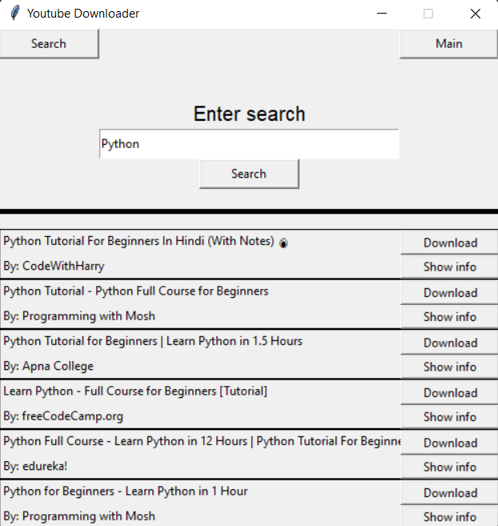
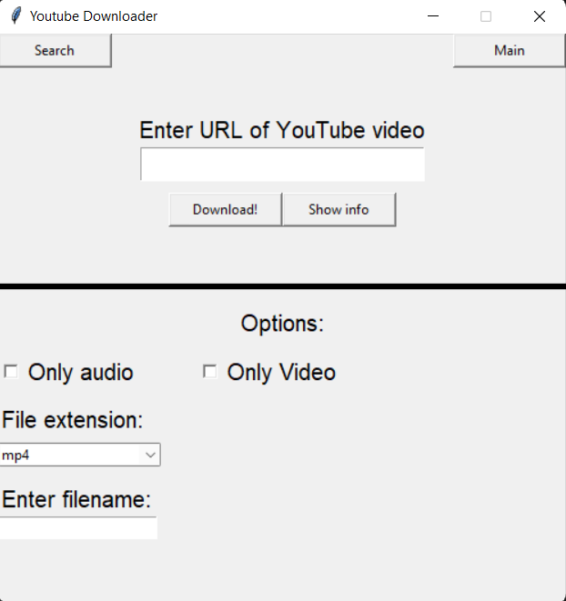

# YouTube-Downloader

Youtube video downloader made with tkinter and pytube.
It also supports playlists.
The program uses multiprocesses so that the program doesn't
stop working or crash while downloading. Multiple videos can be downloaded
at one time because of this. Downloading videos does take a lot of time
so it might take some time for them to download.

## Requirements

The program uses Python 3.10 with the only external package being pytube.
To install run `pip3 install pytube` in the terminal.

### Note

If you are getting some error like this

`pytube.exceptions.RegexMatchError: get_throttling_function_name: could not find match for multiple
`

then refer to [this Github issue](https://github.com/pytube/pytube/issues/1293).

### Important

YouTube is always changing and so pytube keeps on getting updated.
If you are getting errors, then update pytube.

